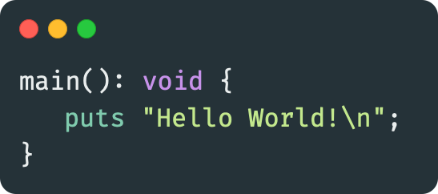
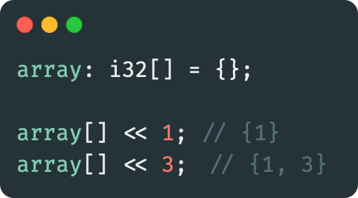
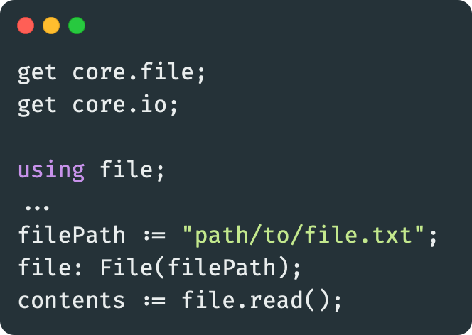
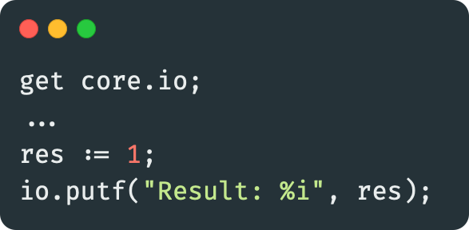
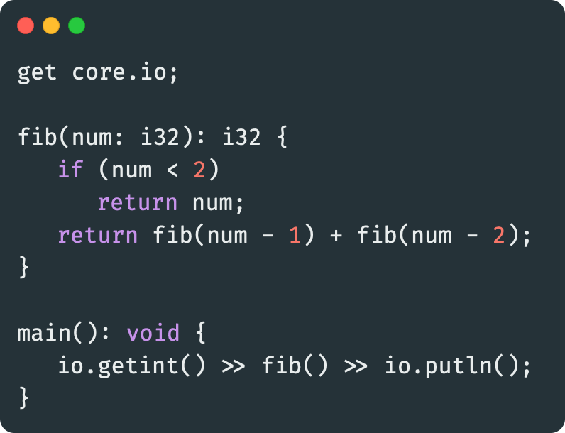

<!--    colors 

"orange":   #fcaa68 (sandy brown)
"red":      #ec243c (imperial red)
"grey":     #595959 (davys grey)
"white":    #e0f2e9 (honeydew)
"purple":   #a390e4 (lavender floral)

-->

    

> __Warning__ - Fux is still in early development

---

**`Flawless Unambiguous Programming`**

## The Beautiful Alternative For C++ 

    
     
    <a href="#examples">Examples</a> | 
    <a href="#state">Language State</a> | 
    <a href="./docs/README.md">Documentation</a>

## Why Fux?

### Flexible, Portable, Fast

- At least as high performant as C++[^1]
- Using LLVM to compile and run on several platforms

### Easy To Learn

- Already known environment for developers with experience in C++
- Pythonic features: automatic typing, inbuilt string type, simple arrays, safe memory managment

### Large Standard Library

- Fux ships with a large standard library packed with utility ready to be used
- The Core Library includes but is not limited to[^3]
    - Console I/O
    - File I/O
    - Mathematics
    - Algorithms

### More Readable Code

- Variable and function types are declared after the name, making reading the code natural
- The pipe operators (`<<`, `>>`) are a core feature of Fux and make it easy to avoid nesting functions[^3]
- Variables, functions and classes can be defined without the usage of a single keyword[^2]

[^1]: As long as the compiler does not have to use garbage collection and take over a lot of work from you.

[^2]: As long as automatic typing is used.

[^3]: More information [here](./docs/).

## State 

### Roadmap

- [&check;] `Error System`
- [&check;] `Lexer`
- [...] `Parser`
- [&cross;] `AST Analysis`
- [&cross;] `IR Generation (LLVM)`
- [&cross;] `Optimization (LLVM)`
- [&cross;] `Compilation (LLVM)`
- [...] `Runtime`
- [...] `Syntax`
- [...] `Standard Library`

Fux is currently still in early development. There is no working compiler avaiable for this language. 

As of now, I am focusing on refining the syntax of Fux, since some aspects are not cleared up yet.
I took inspiration from C++, D, Python, Odin, Elixir and Holy C.

## Examples

### Arrays

### Reading Files

### Formatted Print

### Fibonacci

