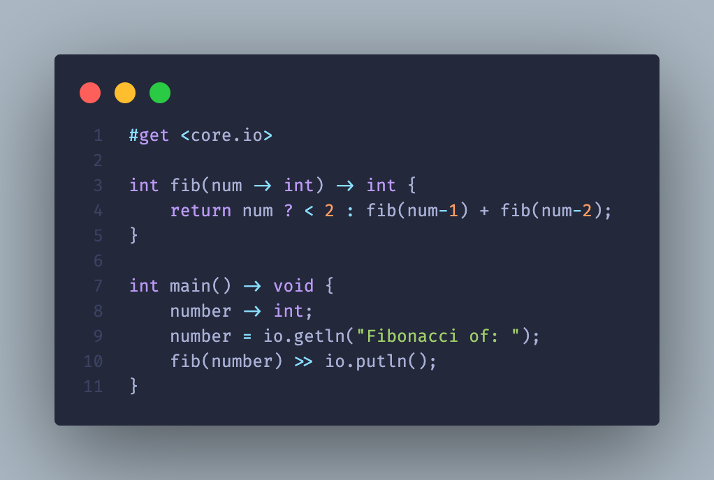

</img>


[](https://github.com/Fuechs/fuxlang/releases/latest)
<br>


---
<!--


-->

<!-- FUX COLORS - #fcaa68 - #ec243c -->

### Fux
###### Flawless unambiguous programming
The beautiful alternative for C++ 
- so you don't shoot yourself in the foot (like I did working on Fux)
- with better errors (well, better than just `Segmentation fault`)
- providing a large standard library

<br>
<!--  -->

<br>

#### Why Fux?

There are many other programming languages out in the wild, so why should someone use Fux? \
My main goal creating the syntax of Fux was to make the language useful for experienced programmers and newbies as an introduction. \
It should be as simple as Python and as complex as Java (or C++ if you wish) at the same time. \
While having to deal with memory in C(++) and too much simplicity in Python, you could also save your time by using Fux. 

Many programmers want languages to have a huge standard library, with file io, http and more fancy stuff. All of your desires are in the core library.

I want Fux to be the answer for `easy language to begin with?`  and `advanced language to continue with?`.

You can define variables like this:

```cpp
// Yes, this isn't common, but shows my point
typedef struct {
    object x -> double;
    object y -> double;
    object z -> double;
} Position;

typedef struct {
    object id -> int;
    object name -> char[10];
    object position -> Position;
} Function;

object function -> Function;
function.id = 0;
function.name = "<function>";
function.position.x = 0.0;
function.position.y = 1.0;
function.position.z = 0.0;

// please don't define single variables like this. It would be inefficient af.
```

> Please be aware of that the syntax is still in development.

or like this:

```cpp
message;
// You literally create an object only by typing an identifier! Cool, isn't it?

message = "Hello World!";
```

And I'm honest, that's what I love about Fux. It's my dream.

#### Setup

To use Fux, simply execute [`./setup/setup.py`](./setup/setup.py) or type [`make setup`](./Makefile) into the terminal after pulling the repository.

#### Documentation

Resources to learn Fux can be found in [`./docs/`](./docs/).
Learning Fux is as easy as following the guide in [`./docs/guide.md`](./docs/guide.md) or using [`./docs/guide.py/`](./docs/guide.py).
