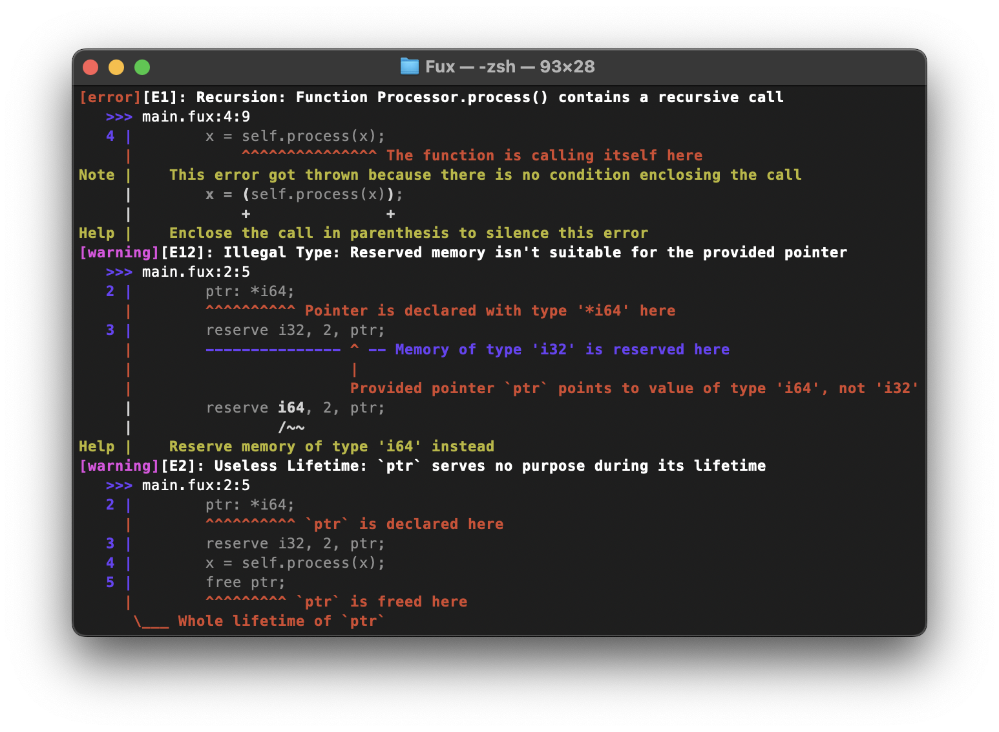
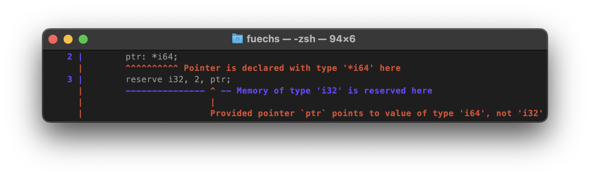
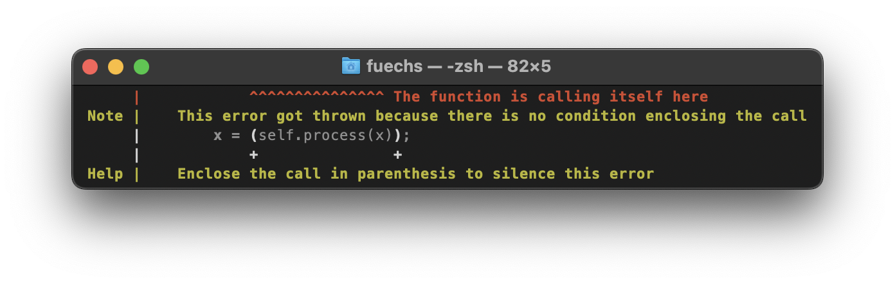
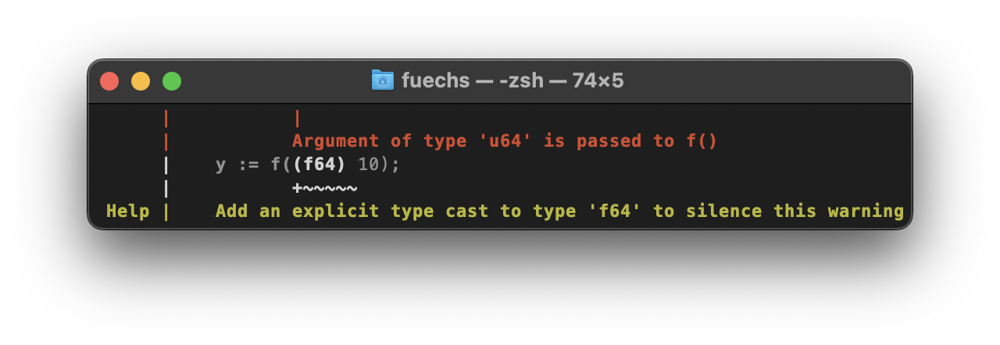
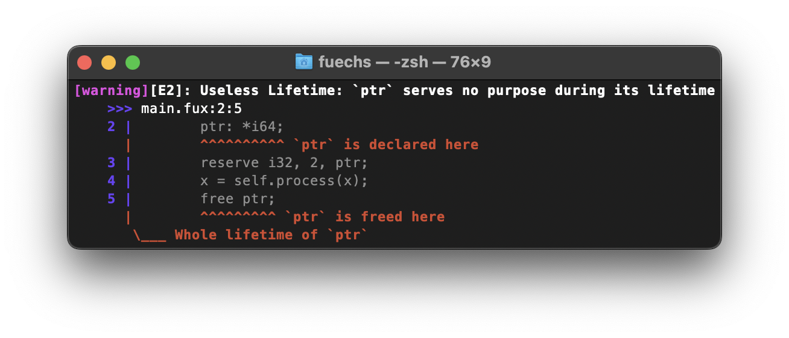
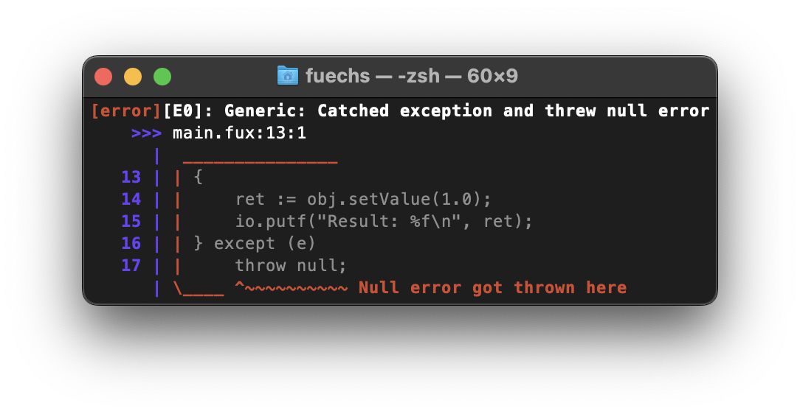

# Errors

The Fux compiler is designed to provide clear and accurate error messages to make it easier for developers to debug their code. This documentation provides an overview of the error messages generated by the Fux compiler and offers tips and guidance on how to interpret and resolve these errors. By understanding the errors and how to address them, developers can improve their productivity and produce higher-quality code.

This documentation may also be used by contributors to understand how errors are represented internally by the compiler.

###### Example from [README](../README.md)



### Table of Contents

- [Types](#types)
- [Titles](#titles)
- [Subjects](#subjects)
- [Markings](#markings)  
    - [Underline](#underline)
    - [Pointer](#pointer)
    - [Note & Help](#note--help)
    - [Replace, Insert & Remove](#replace-insert--remove)
    - [Remove](#remove)
    - [Multiline](#multiline)
    - [Highlight](#highlight)

# Types

The compiler uses flags to categorize errors as warnings or aggressive. This makes it easier for developers to identify and address issues in their code. Each error is also assigned a unique ID that corresponds to a particular error type. Currently, the error IDs do not necessarily have any specific meaning beyond identifying the type of error.

```
[error][AE17]: ...
 ^~~~~  ^ ^~
  \      \  \__ error id (17)
   \      \____ aggressive (true)
    \__________ error type (error)
```

- **`Error`** \
    Errors stop the compiler process and must be fixed before the code can be executed.
    
- **`Warning`** \
    Warnings should be acknowledged, but can be ignored if the code is functioning as intended. They indicate potential issues, logical errors or subjective problems and do not halt the compiler process.
    
- **`Aggressive`** \
    Aggressive errors are a type of error or warning that can be thrown by the Fux compiler when instructed to do so with the `-a` flag. These errors can potentially stop the compiler process, and typically involve subjective or logical issues.
    

# Titles

Error titles usually provide a bit of context for the error, but the majority of information about the error can be found in the markings provided with the error itself. ([-> Markings](#markings))

# Subjects

An error typically has 1-2 subjects, with the second subject serving as a reference for the error that may be relevant and located in a different file. A subject consists of several markings that provide detailed information about the error. A subject can also refer to a traceback subject, which helps trace back to where an error occurred.

###### Declared in [`src/frontend/error/subject.hpp`](../src/frontend/error/subject.hpp)
```cpp
struct Subject {
    Metadata meta;      // file name, original source code 
    Marking::Vec marks; // markings that are part of the visual output
    Subject *traceback; // traceback to error origin 
};
```

# Markings

Markings are used to pinpoint the exact location and reason for an error. They include arrows and highlighting to show the position in the code, as well as short messages that explain the error and offer tips or even direct solutions to fix it. Markings can suggest modifications to the code by [inserting or removing text or adjusting the existing code](#replace-insert--remove).

## Underline

Underlines can be represented by arrows (`^`) or dashes (`-`). Arrows are usually used to indicate the underline, but dashes are used if a [pointer](#pointer) needs to be shown in between.



## Pointer

Pointers are located in between underlines and indicate things that are contained within other marked elements.

## Note & Help

Error notes and tips can provide additional information to help diagnose and fix compiler errors. 

- Notes may contain details on how the error was detected and why it was thrown. 
- Help messages can suggest ways to fix or work around the error. 

By reading and understanding the notes and tips provided with each error, developers can more easily identify the root cause of the issue and take appropriate action to resolve it.



## Replace, Insert & Remove

Errors may include suggestions on how to fix or resolve them by visually indicating modifications to the original code through insertions (`+~~~`), deletions or replacements (`/~~~`). These modifications are usually accompanied by a help message that explains them. 



## Multiline

Multiline markings insert information at the end of a range of lines of code.



## Highlight

Highlights usually bring out code blocks or a part of code where the compiler error itself was thrown by the user. 

